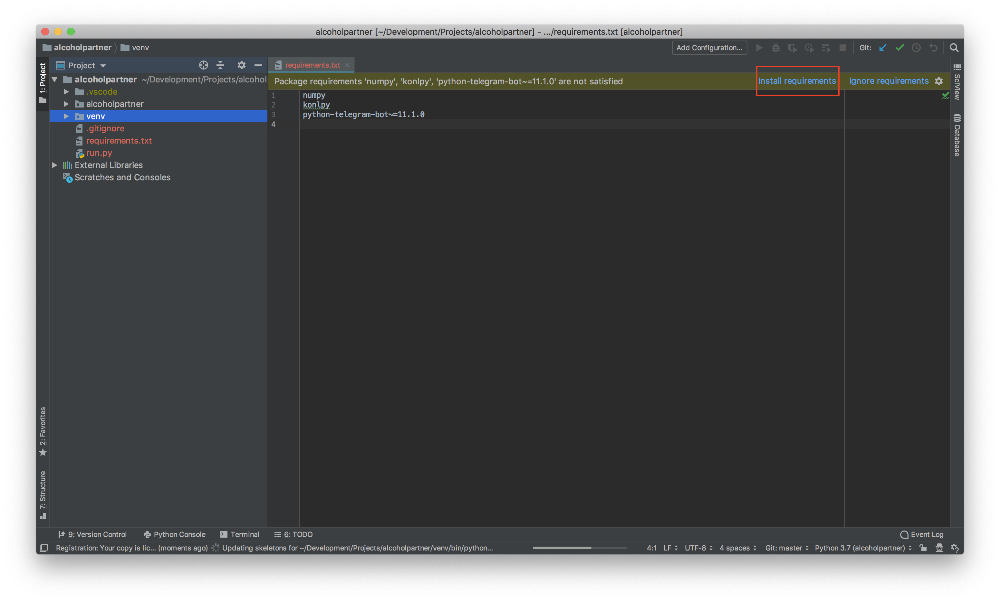

# 알코올파트너

알코올 파트너 프로젝트 소스코드입니다.

## 준비

### 1. 사전 설치 사항

1. [Python](https://python.org)을 3.7 버전으로 설치합니다.

2. [JDK (Java SE)](https://www.oracle.com/technetwork/java/javase/downloads/index.html)를 설치합니다.

   가이드 - https://extrememanual.net/12940

3. Windows의 경우, [konlpy](http://konlpy.org/ko/latest/install/)를 설치합니다.

### 2. 라이브러리 설치

필요한 라이브러리의 목록은 `requirements.txt` 파일에 명시되어 있습니다. [Pycharm](https://www.jetbrains.com/pycharm/)을 사용하는 경우, `requirements.txt`을 자동으로 인식하여 라이브러리 설치 옵션을 제공하므로, 이번 섹션을 건너뛸 수 있습니다.



Pycharm을 사용하지 않고, 직접 설치하는 경우 다음과 같이 따라하세요.

1. Windows의 경우 명령프롬프트를 실행해 소스코드가 있는 경로로 이동합니다. (`cd` 명령어 사용, https://m.blog.naver.com/haejoon90/220740593679)

   Linux, macOS의 경우 터미널을 실행해 소스코드가 있는 경로로 이동합니다.

2. `pip` 명령어를 이용해 라이브러리를 일괄 설치합니다.

    ``` bash
    $ pip install -r requirements.txt
    ```

### 3. 텔레그램 봇 생성

텔레그램 봇은 [BotFather를 통해 생성할 수 있습니다.](https://core.telegram.org/bots#6-botfather)

생성 후 발급되는 토큰(token)을 잘 보관하세요.

### 4. 토큰 입력

`run.py` 파일을 열어, 봇 생성시 발급받은 토큰을 `<TOKEN_HERE>` 부분에 넣어주세요.

## 실행

실행법은 간단합니다. `run.py`가 진입점입니다.

``` bash
$ python run.py
```

혹은 Pycharm을 사용중이라면, 좌측 파일 목록에서 `run.py` 파일을 마우스 오른쪽으로 클릭한 후 _Run_ 버튼을 누르시면 됩니다.
